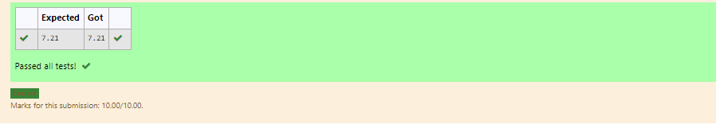

# DISTANCE-BETWEEN-TWO-POINTS

## AIM:
To write a python program to find the distance two 2 points
## ALGORITHM:
### Step 1:
start the program 
### Step 2: 
get the values
### Step 3: 

Substitute the values in the distance formula  
### Step 4:
display the program 
### Step 5:
end the program  
### PROGRAM:x1=4
y1=2
x2=10
y2=6
d=math.sqrt((x2-x1)**2+(y2-y1)**2)
print(format(d,".2f"))
### OUTPUT:

### RESULT:
Thus the program is executed. 
